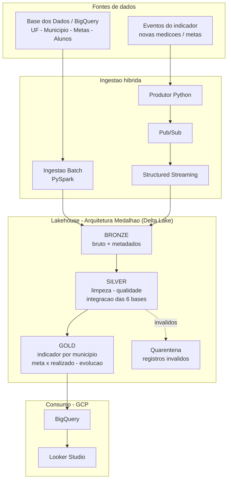

# Pipeline Híbrido para Análise da Alfabetização no Brasil
> **Pós-Graduação em AI Scientist – FIAP** · Tech Challenge – Fase 2

Pipeline de dados híbrida (**Batch + Streaming**) em nuvem que integra as fontes do
**Indicador Criança Alfabetizada**, seguindo a **Arquitetura Medalhão
(Bronze → Silver → Gold)**, com foco em qualidade, escalabilidade e eficiência de
custos (FinOps).

---

## 1. Contexto do problema

A alfabetização na infância é um dos pilares do desenvolvimento educacional, social e
econômico do país. O **Compromisso Nacional Criança Alfabetizada** mobiliza União,
estados, Distrito Federal e municípios para garantir que toda criança esteja
alfabetizada até o final do **2º ano do ensino fundamental**.

Em 2023, a **Pesquisa Alfabetiza Brasil** (INEP) definiu o **ponto de corte de 743
pontos** na escala de proficiência do **Saeb** — nível a partir do qual uma criança é
considerada alfabetizada. Desse parâmetro nasceu o **Indicador Criança Alfabetizada**,
que expressa o percentual de estudantes que atingem esse patamar. A meta nacional é
que, **até 2030**, todas as crianças estejam alfabetizadas ao final do 2º ano.

Compreender os fatores que influenciam esse processo exige integrar diferentes fontes
de dados públicos — metas nacionais/estaduais/municipais, dados territoriais,
microdados educacionais e indicadores de desempenho — para subsidiar **políticas
públicas baseadas em evidências**.

## 2. Desafio educacional e uso do indicador

Atuando como um time de engenharia de dados de uma organização pública de análise
educacional, o objetivo é integrar as fontes do indicador de alfabetização em uma
camada analítica confiável que permita responder perguntas como:

- Qual o percentual de crianças alfabetizadas **por município** e por UF?
- Quão distante cada território está da **meta** definida (meta × realizado)?
- Como o indicador **evolui ao longo do tempo** rumo à meta de 2030?
- Onde estão as maiores **desigualdades educacionais** entre regiões?

A camada Gold resultante alimenta dashboards, análises estatísticas e, futuramente,
modelos de Machine Learning (ver seção *Aplicação em IA*).

**Fonte de dados:** [Indicador Criança Alfabetizada – Base dos Dados](https://basedosdados.org/).

## 3. Arquitetura proposta

Arquitetura **Lakehouse** com ingestão híbrida e camadas medalhão:

| Camada | Papel | Formato |
|--------|-------|---------|
| **Bronze** | Dados brutos ingeridos das fontes, sem transformação, histórico completo + metadados de ingestão | Delta/Parquet |
| **Silver** | Limpeza, tratamento de nulos, padronização de tipos/nomes, validação de consistência, **normalização de chaves e integração das 6 bases** | Delta/Parquet |
| **Gold** | Datasets analíticos: indicador por município, metas × resultados, evolução temporal | Delta + BigQuery |

**Fontes integradas (6):** UF · Meta Alfabetização Brasil · Meta Alfabetização por UF ·
Meta Alfabetização por Município · Município · Dados de alunos.

**Ingestão híbrida:**
- **Batch** — dados históricos de metas, municípios e agregados nacionais (Base dos Dados).
- **Streaming** — simulação de eventos quase-real-time (novas medições do indicador,
  atualização de metas/resultados) via produtor Python → Pub/Sub → Structured Streaming.

## 4. Descrição da arquitetura da solução

> _Desenvolvimento e execução do Spark: **Databricks Free Edition** (Delta Lake +
> Structured Streaming). Nuvem de destino: **GCP**._

- **Fonte:** Base dos Dados (BigQuery público), acessada via pacote `basedosdados`.
- **Bronze:** notebooks PySpark gravam os dados brutos particionados por data de ingestão.
- **Streaming:** produtor Python publica eventos em Pub/Sub; Structured Streaming
  consome e grava na Bronze de streaming.
- **Silver:** limpeza + regras de qualidade + join das bases por `id_municipio` / `sigla_uf` / `ano`.
- **Gold:** tabelas analíticas em Delta, exportadas para **BigQuery** (serverless).
- **Consumo:** dashboard no **Looker Studio** sobre o BigQuery.

## 5. Diagrama da pipeline



Detalhes e mapeamento para serviços GCP em [`docs/arquitetura.md`](docs/arquitetura.md).

## 6. Fluxo de dados

**Extração** (Base dos Dados + eventos) → **Bronze** (bruto + metadados) → **Silver**
(limpeza, qualidade, normalização de chaves e integração das 6 bases; inválidos vão para
quarentena) → **Gold** (indicador por município, meta × realizado, evolução temporal) →
**Consumo** (BigQuery + Looker Studio).

Fluxo completo, com as transformações de cada camada, em
[`docs/fluxo-de-dados.md`](docs/fluxo-de-dados.md).

## 7. Tecnologias utilizadas

| Componente | Ferramenta | Justificativa |
|-----------|-----------|---------------|
| Fonte | Base dos Dados (BigQuery) | Datasets educacionais estruturados, nativos do BigQuery |
| Processamento | Apache Spark / PySpark (Databricks) | Padrão de mercado para processamento distribuído; alinhado ao curso |
| Camadas | Delta Lake | Transações ACID, time travel e schema enforcement sobre o data lake |
| Streaming | Pub/Sub + Structured Streaming | Ingestão desacoplada de eventos em tempo quase-real |
| Warehouse analítico | BigQuery | Serverless, pay-per-scan — melhor eficiência de custos (FinOps) |
| Armazenamento | Parquet particionado (GCS) | Formato colunar comprimido, leitura seletiva (columnar pruning) |
| Visualização | Looker Studio | Dashboard gratuito integrado ao BigQuery |

## 8. Decisões arquiteturais (trade-offs)

- **Batch vs Streaming** — metas e cadastros mudam pouco → **batch**; medições novas do
  indicador precisam de baixa latência → **streaming**. Adotamos os dois (híbrido).
- **Data Lake vs Data Warehouse** — usamos **Lakehouse**: dados brutos/tratados em Delta
  no lake (flexível e barato) e a Gold também no **BigQuery** (governança e performance de BI).
- **Custo vs Performance** — Parquet + particionamento reduzem I/O; BigQuery cobra por
  dados lidos, então otimização de queries e partições impacta diretamente o custo.

## 9. Monitoramento e FinOps

> _A ser detalhado (Passos 6 e 8) — ver `docs/finops.md`._

## 10. Aplicação em IA

> _A ser detalhado (Passo 9): predição de alfabetização por município, análise de
> desigualdade educacional e políticas públicas baseadas em dados._

## 11. Estrutura do repositório

```
tech-challenge-alfabetizacao/
├── config/            # configuração central (caminhos, fontes, regras de qualidade)
├── notebooks/         # notebooks Databricks (bronze, streaming, silver, gold)
├── src/
│   ├── ingestion/     # ingestão batch (Base dos Dados) e produtor de streaming
│   ├── quality/       # scripts de validação e qualidade de dados
│   └── transformations/  # lógica de Silver e Gold
├── docs/              # arquitetura, fluxo de dados, FinOps, diagrama
└── data/              # camadas locais para dev (não versionado)
```

## 12. Como executar

> _A ser detalhado conforme os notebooks forem construídos._

---

## 👤 Autores

**Thiago Corrêa Carvalho Diniz** — RM 371212
_(demais integrantes do grupo)_

Pós-Graduação AI Scientist — FIAP
