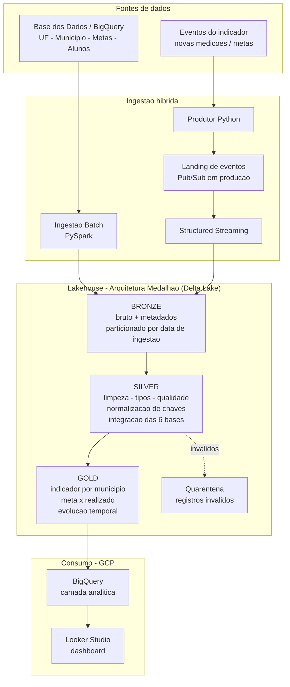

# Arquitetura da Solução

Pipeline híbrida (Batch + Streaming) em arquitetura **Lakehouse**, organizada nas
camadas medalhão **Bronze → Silver → Gold**. O desenvolvimento e a execução do
Spark acontecem no **Databricks Free Edition** (Delta Lake + Structured Streaming), e
a nuvem de destino é o **GCP** (fonte e camada analítica no BigQuery, dashboard no
Looker Studio).

## Diagrama da pipeline

## Camadas da arquitetura

### Bronze — dados brutos
- Ingestão fiel das fontes, **sem regras de negócio**.
- Enriquecimento apenas com **metadados de ingestão** (timestamp, fonte, tipo batch/streaming).
- Particionamento por **data de ingestão**; histórico completo preservado para auditoria
  e reprocessamento.

### Silver — dados tratados e integrados
- Limpeza, tratamento de valores ausentes e **padronização de tipos e nomes**.
- **Validação de qualidade** (duplicidade, nulos em chaves, faixas válidas, consistência
  entre tabelas); registros reprovados vão para a **quarentena**.
- **Normalização de chaves** (`id_municipio`, `sigla_uf`, `ano`) e **integração das 6 bases**.

### Gold — camada analítica
- Datasets prontos para consumo: **indicador por município**, **meta × realizado** e
  **evolução temporal** do indicador.
- Publicada em **Delta** (Databricks) e exportada para o **BigQuery** (consumo por BI/ML).

## Mapeamento para serviços GCP (produção)

| Função | Databricks (dev) | GCP (produção) |
|--------|------------------|----------------|
| Fonte batch | leitura via `basedosdados` | BigQuery (datasets públicos) |
| Ingestão streaming | Structured Streaming | Pub/Sub + Dataflow/Spark |
| Armazenamento das camadas | Volumes / Delta | Cloud Storage (Parquet particionado) |
| Camada analítica | Delta | BigQuery |
| Orquestração | Jobs Databricks | Cloud Composer (Airflow) |
| Visualização | — | Looker Studio |
