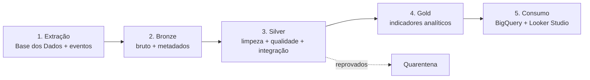

# Fluxo de Dados

Descrição ponta a ponta de como o dado percorre a pipeline, desde a fonte até o
consumo analítico.

## 1. Extração (fontes)

| Fonte | Modo | Conteúdo |
|-------|------|----------|
| UF | Batch | diretório de unidades federativas |
| Município | Batch | diretório de municípios (id, nome, UF) |
| Meta Alfabetização Brasil | Batch | meta nacional por ano |
| Meta Alfabetização por UF | Batch | meta estadual por ano |
| Meta Alfabetização por Município | Batch | meta municipal por ano |
| Dados de alunos | Batch | microdados / proficiência (Saeb) |
| Eventos do indicador | Streaming | novas medições e atualizações de metas/resultados |

## 2. Bronze — ingestão bruta

- **Batch:** as tabelas são lidas da Base dos Dados e gravadas *as-is* em Delta.
- **Streaming:** o produtor publica eventos JSON em Pub/Sub; o Structured Streaming
  consome e grava na Bronze de streaming.
- Cada registro recebe metadados: `data_ingestao`, `fonte`, `tipo_ingestao`.
- Particionamento por `data_ingestao`.

## 3. Silver — tratamento e integração

Transformações aplicadas:

1. **Padronização de tipos** — datas, inteiros, decimais (ex.: `proficiencia` como DOUBLE).
2. **Padronização de nomes** — colunas em snake_case; chaves com nome único
   (`id_municipio`, `sigla_uf`, `ano`).
3. **Tratamento de nulos** — remoção/flag conforme a criticidade da coluna.
4. **Validação de qualidade** (ver `docs/finops.md` e scripts em `src/quality/`):
   - duplicidade por chave primária;
   - nulos em chaves;
   - faixas válidas (indicador 0–100%, ano 2019–2030, proficiência 0–1000);
   - consistência referencial entre tabelas (todo `id_municipio` existe no diretório).
5. **Quarentena** — registros reprovados são isolados com o motivo da falha.
6. **Integração** — join das 6 bases por `id_municipio` / `sigla_uf` / `ano`, resultando
   em uma visão unificada município × ano com meta e resultado.

## 4. Gold — camada analítica

Datasets derivados da Silver integrada:

| Dataset | Descrição |
|---------|-----------|
| `indicador_por_municipio` | % de crianças alfabetizadas por município e ano |
| `meta_vs_realizado` | comparação entre meta e resultado (gap para a meta) |
| `evolucao_temporal` | série histórica do indicador rumo à meta de 2030 |

Aplica-se o ponto de corte do Saeb (**743**) para classificar alfabetização quando
partimos da proficiência dos alunos.

## 5. Consumo

- Tabelas Gold exportadas para o **BigQuery** (serverless, pay-per-scan).
- **Looker Studio** consome o BigQuery para o dashboard (indicador por região, gap para
  a meta, evolução temporal).
- A Gold também está pronta para alimentar modelos de ML (ver seção *Aplicação em IA*
  no README).
